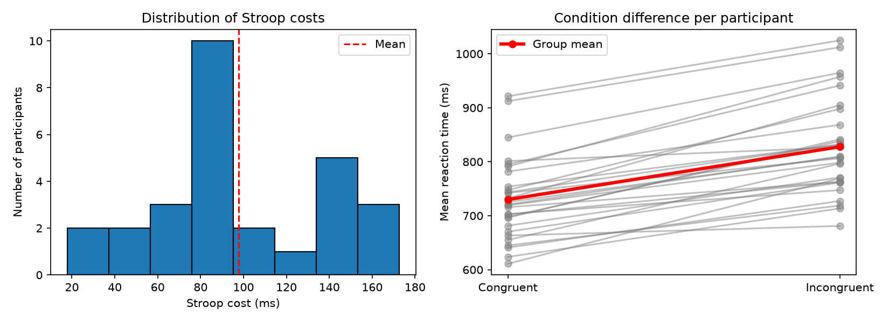

# stroop-analysis
# Stroop Effect Analysis on Open Data

A small Python project I made to practice data cleaning and basic statistics on real behavioral data. I calculate each participant's Stroop cost and test whether the Stroop effect shows up in the data.

*This is a learning project using a public dataset. I did not collect the data, and the results are not a new scientific finding.*

## Data

OpenNeuro dataset `ds000164`: a color-word Stroop task (congruent, incongruent and neutral trials) done during fMRI scanning. I only used the behavioral files (`*_events.tsv`): 28 participants, about 120 trials each.

Citation and license: [Timothy D. Verstynen (2018). Stroop Task. OpenNeuro. [Dataset] doi: null]

## What I did

In the Stroop task, people name the ink color of a word. It is harder when the word names a different color (incongruent) than when it matches (congruent). I measured this as:

`Stroop cost = mean RT (incongruent) - mean RT (congruent)`, calculated for each participant.

1. **Merged** the 28 participant files into one table.
2. **Cleaned** the trials:
   - fixed one typo in the condition labels (`neutral=`)
   - kept only congruent and incongruent trials (neutral is not needed for the cost)
   - kept only correct responses
   - removed reaction times under 200 ms (this also removes trials with no response)
   - removed reaction times more than 3 SD from each participant's own mean

   This kept 1,961 of 2,166 trials (205 removed, about 9.5%). The 200 ms and 3 SD cutoffs are common rules of thumb that I chose myself; I did not check what the original study used.
3. **Calculated** each participant's mean RT per condition and their Stroop cost.
4. **Categorized** participants by cost: lowest 25% = bottom, middle 50% = middle, highest 25% = top.
5. **Tested** the effect with a paired t-test and Cohen's d, and made two plots.

## Results

| | M (ms) | SD |
|---|---|---|
| Congruent RT | 730.0 | 77.1 |
| Incongruent RT | 827.8 | 90.2 |
| Stroop cost | 97.8 | 41.8 |

Reaction times were slower on incongruent trials, paired t(27) = 12.37, p < .001, d = 2.34. All 28 of 28 participants had a positive Stroop cost.



Categories: 7 participants bottom, 14 middle, 7 top.

## Limitations

- **The categories are relative.** They only rank these 28 people against each other and are not a diagnosis. The borders are also arbitrary: a cost of 140.4 ms is "middle" but 141.4 ms is "top".
- **Small sample.** 28 people is too few to generalize, and I did not look at age or gender.
- **Distribution.** The histogram of costs is not a clean bell curve. I only checked this by eye and did not run a normality test or a non-parametric test (a good next step).
- **Scanner setting.** The data were collected in an MRI scanner, which may differ from normal lab or online testing.
- **Trials per person.** I checked the total number of clean trials but not the minimum per condition for each participant.

## Files and how to run

- `download_data.py`: downloads only the `*_events.tsv` files
- `analyse.py`: cleaning, Stroop cost, categories, statistics, plots
- `stroop_results.csv` and `stroop_plots.png`: outputs

```
pip install pandas scipy matplotlib openneuro-py
python download_data.py
python analyse.py
```
